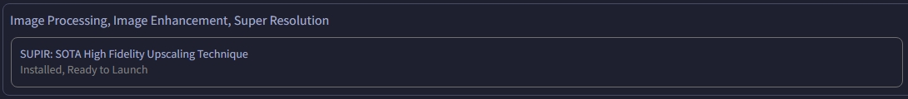

<h1 align="center">SUPIR for Forge</h1>

<b><i>BETA</i></b>

> [!IMPORTANT]
> This repo is still under testing... Non tech-savvy person is recommended to wait for a more stable release...
>
> PRs are welcomed!

> [!TIP]
> <ins><b>Hardware Requirement</b></ins>
> - **GPU VRAM:** 10+ GB
> - **RAM:** 32+ GB

> [!CAUTION]
> Currently, only GPUs with `fp8` capability is supported

## Prerequisite
0. Update your [Forge Webui](https://github.com/lllyasviel/stable-diffusion-webui-forge) to the latest version
1. Download `SUPIR-v0Q_fp16.safetensors` from https://huggingface.co/Kijai/SUPIR_pruned/tree/main
2. Create a `SUPIR` folder in your Webui `models` folder
3. Place the model inside the folder

> You also need a **SDXL** checkpoint

## Installation
1. Go to the **Extensions** tab
2. Select the **Install from URL** section
3. Paste `https://github.com/Haoming02/forge-space-SUPIR` into the `URL for extension's git repository` field
4. Click **Install** and wait for the installation
5. Switch to the **Installed** section
6. Click **Apply and restart UI**
7. Go to the **Spaces** tab
8. Find the **SUPIR** space, click **Install**, and wait for the installation
9. **Important:** Select a **SDXL** checkpoint in the `Quicksettings` first
10. Press **Launch**

UI Screenshot

## Benchmark

Upscale a `600x800` image to `1216x1600` using `48` steps, on a **RTX 3060** took `~2.5` min

 
<code>256x256 Input</code>

 
<code>1024x1024 Output</code>

## Known Issue

- Using `Preprocess` seems to make the result worse...

> [!NOTE]
> While this wrapper is under the MIT license, the underlying SUPIR project and models are for **[non-commercial](https://github.com/Fanghua-Yu/SUPIR/blob/master/LICENSE)** only!

    <a href="https://arxiv.org/abs/2401.13627">Paper</a> &emsp; <a href="http://supir.xpixel.group/">Project Page</a> &emsp; <a href="https://github.com/Fanghua-Yu/SUPIR">GitHub Repo</a>

